# Beyond the Can — What Drives Red Bull’s Digital Dominance

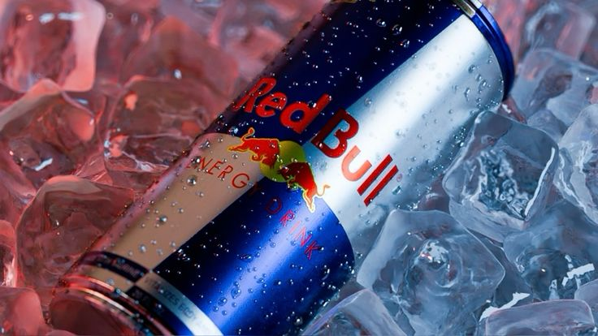

A comprehensive brand intelligence and predictive analytics project focused on analyzing Red Bull’s global digital engagement patterns using Google Trends data, Python, Jupyter Notebook, MariaDB/SQL, Machine Learning, and interactive Power BI visualizations.

Built an end-to-end analytics pipeline integrating data engineering, exploratory analysis, machine learning, SQL querying, and interactive business intelligence dashboards.

---

## Project Overview

This project explores how Red Bull has evolved beyond an energy drink brand into a global media, motorsport, esports, and entertainment powerhouse.

Using Google Trends data, the project analyzes:

* Red Bull search popularity
* Formula 1 influence on brand visibility
* Competition with Monster Energy
* Esports engagement trends
* Event-driven search spikes
* Business insights from digital audience behavior

The project combines:

* Python for EDA and Machine Learning
* MariaDB for SQL analysis
* Power BI for dashboard visualization
* Jupyter Notebook for analysis workflow

---

## Technologies Used

* Python
* Jupyter Notebook
* Pandas
* NumPy
* Matplotlib
* Seaborn
* Scikit-learn
* MariaDB
* SQL
* Power BI

---

## Machine Learning Model

### Model Used

* Random Forest Regressor

### Purpose

Predict Red Bull popularity based on:

* Formula 1
* Monster Energy
* Red Bull Racing
* Esports

### Evaluation Metrics

* MAE
* RMSE
* R² Score
* Cross Validation

---

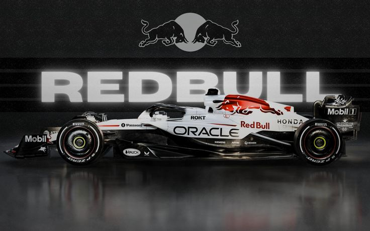

## Key Insights

* Formula 1 strongly influences Red Bull search popularity.
* Red Bull Racing spikes align with major race events.
* Esports engagement shows increasing Gen Z interest.
* Monster Energy maintains stable competition but lower search peaks.
* Event-driven marketing creates significant online visibility.
* Red Bull behaves more like a media and entertainment brand than a traditional beverage company.

---

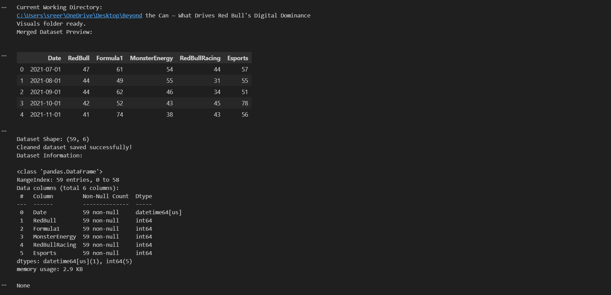
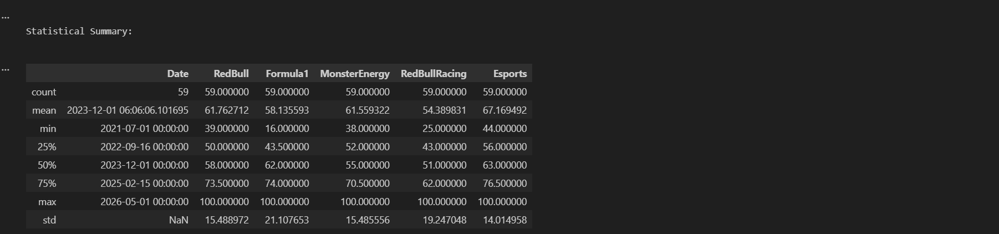
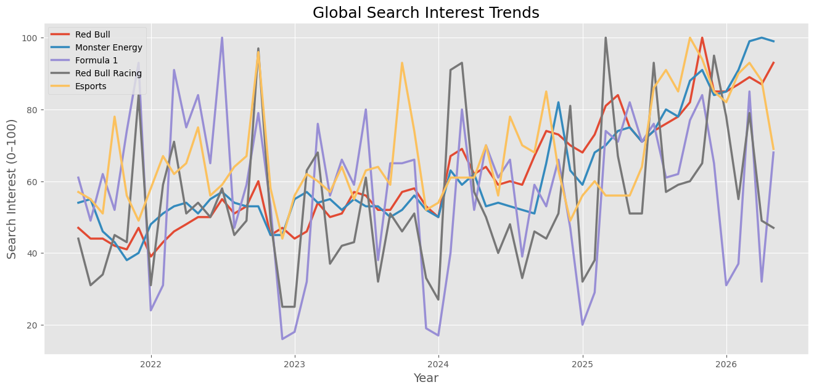
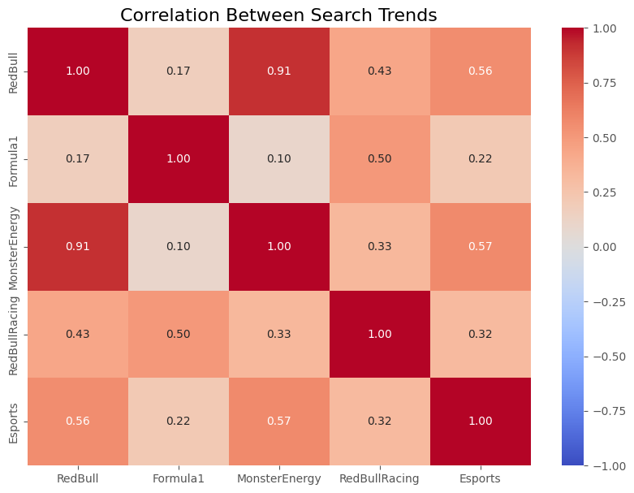
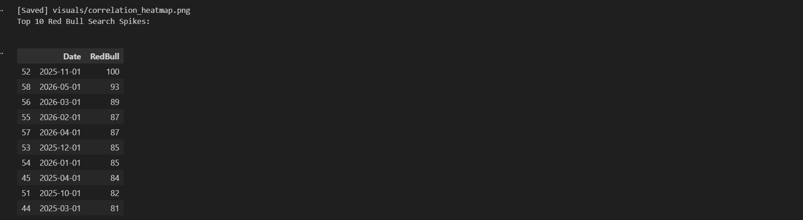
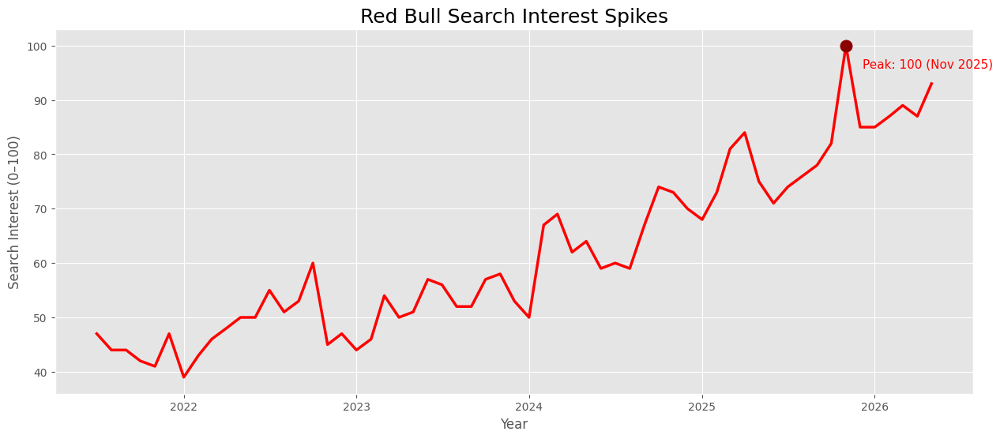
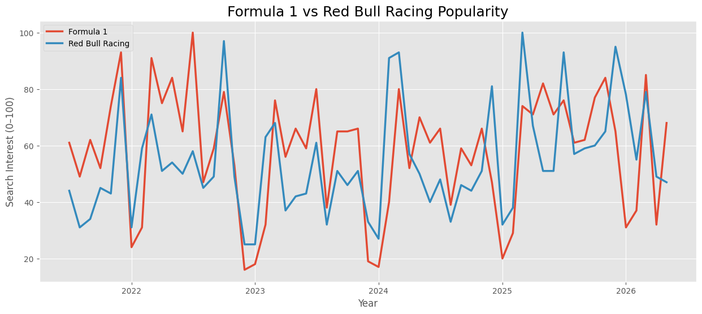
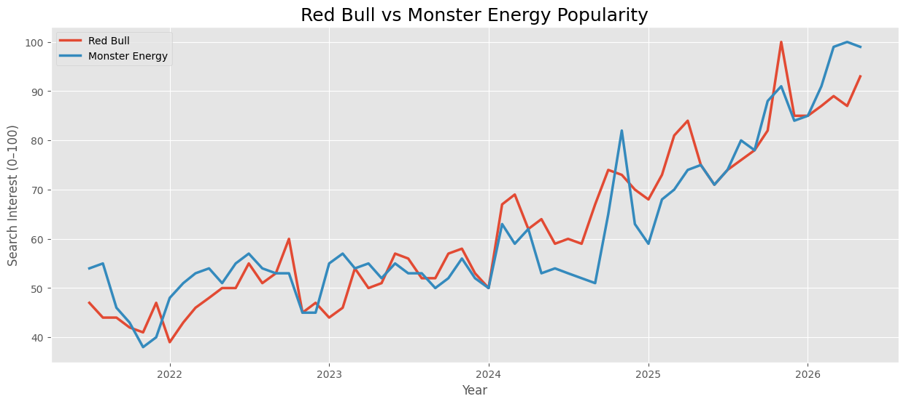
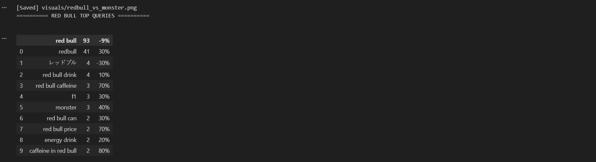
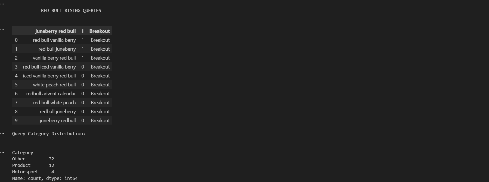
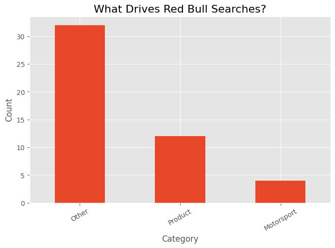
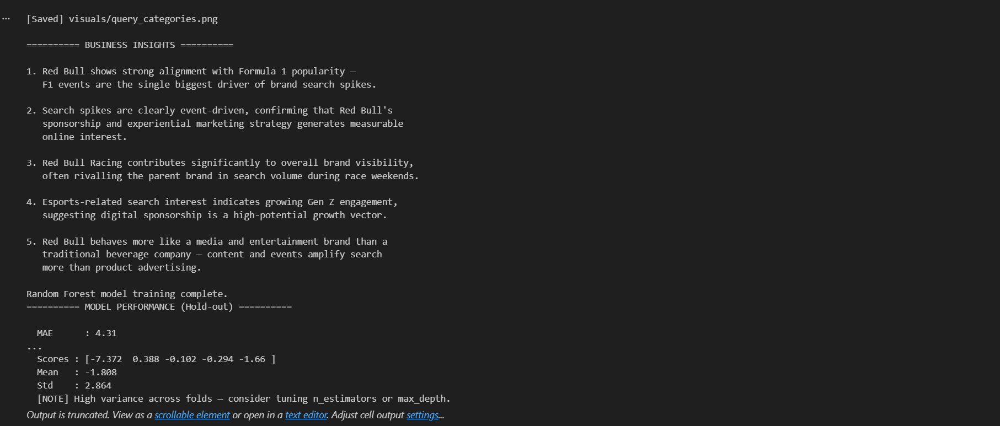
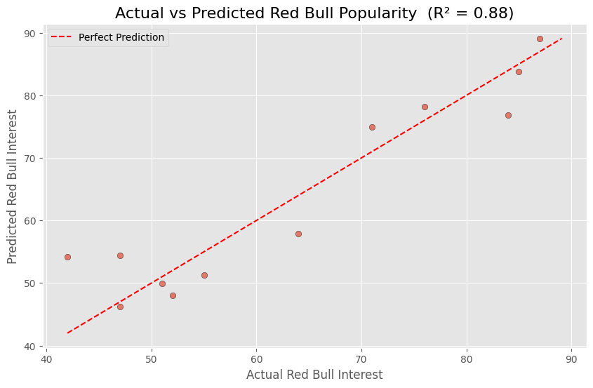
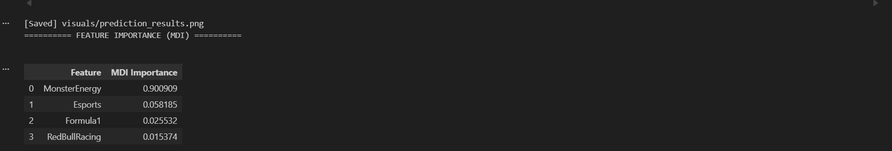
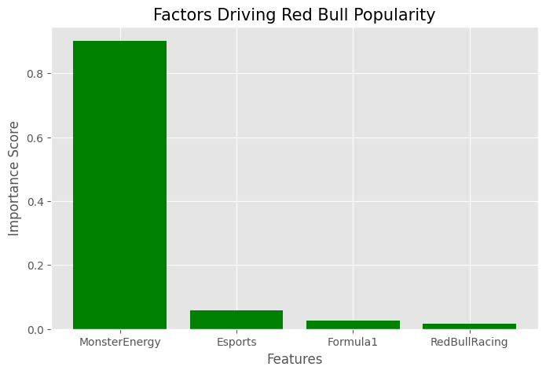
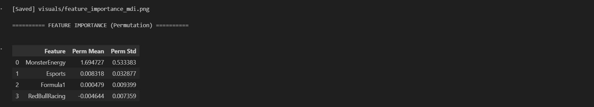
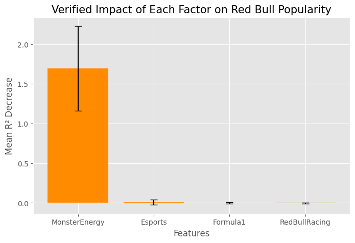
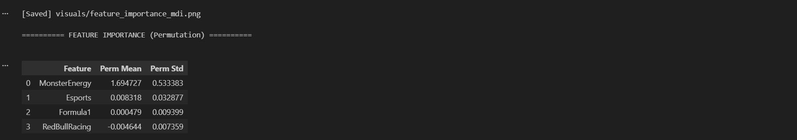

## Dashboard Features

- Interactive KPI Cards
- Global Search Trend Analysis
- Correlation Heatmap Visualization
- Formula 1 vs Red Bull Racing Popularity Analysis
- Red Bull vs Monster Energy Competitive Analysis
- Red Bull Search Spike Detection
- Query Category Classification
- Business Insight Generation
- Machine Learning-Based Popularity Prediction
- Actual vs Predicted Performance Visualization
- Feature Importance Analysis (MDI & Permutation)
- Future Scenario Prediction Modeling
- Automated Data Cleaning & Transformation
- SQL Database Integration with MariaDB
- Power BI Interactive Dashboard Design
- Exportable Analytics Visualizations
- Google Trends Data Analysis
- Cross-Validation Model Evaluation
- Statistical Summary & EDA


---

## Project Structure

```bash
Beyond the Can — What Drives Red Bull's Digital Dominance/
│
├── data/
├── cleaned_dataset/
├── cleaned_redbull_master_v3.csv 
├── visuals
├── images
├── notebook/
├── redbull_brand_intelligence_report.ipynb
├── sql
├── powerbi_dashboard/
├── redbull_brand_intelligence_report.pbix
├── README.md
├── requirements.txt
├── redbull_predictions.csv
```

---

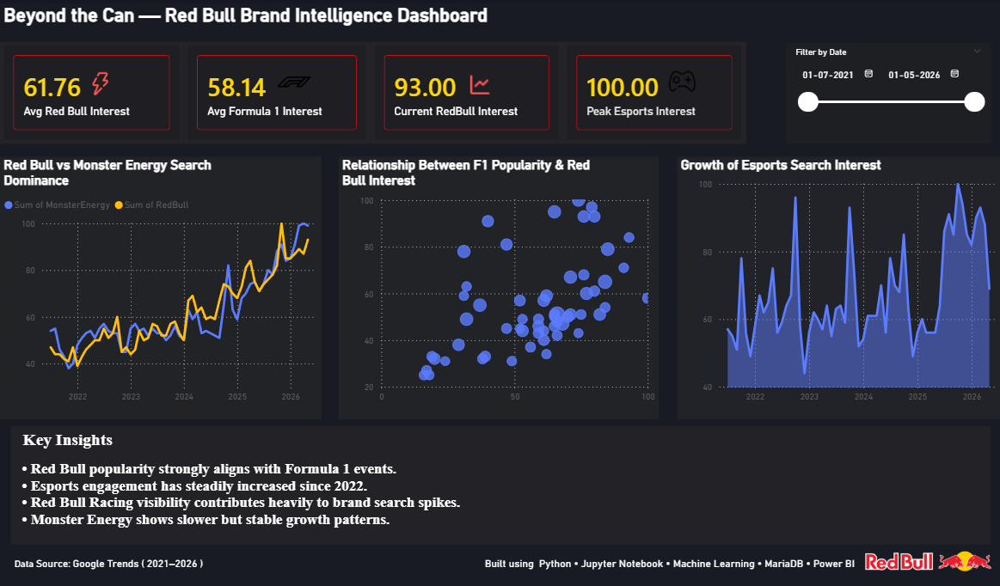

## Power BI Dashboard

The Power BI dashboard provides an interactive analytics experience for exploring Red Bull’s digital dominance and audience engagement trends.

### Main Visuals

* Trend Comparison Charts
* Correlation Analysis
* KPI Cards
* Scatter Analysis
* Insights Panel

---

## Dataset Source

### Source

Google Trends

### Time Period

2021–2026

---

## How to Run the Project

### 1. Clone Repository

```bash
git clone https://github.com/sreeragsrinu/git clone https://github.com/sreeragsrinu/beyond-the-can-redbull-analytics.git
```

### 2. Install Requirements

```bash
pip install -r requirements.txt
```

### 3. Run Jupyter Notebook

```bash
jupyter notebook
```

---

## requirements.txt

```text
pandas
numpy
matplotlib
seaborn
scikit-learn
```

---

## SQL Analysis

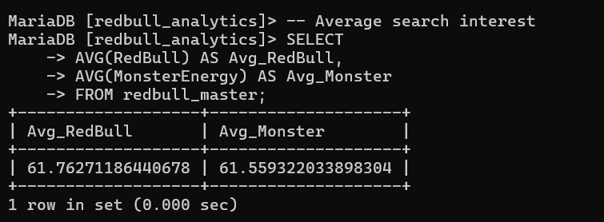

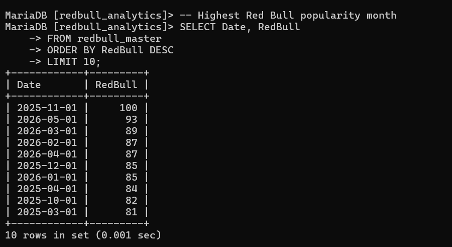

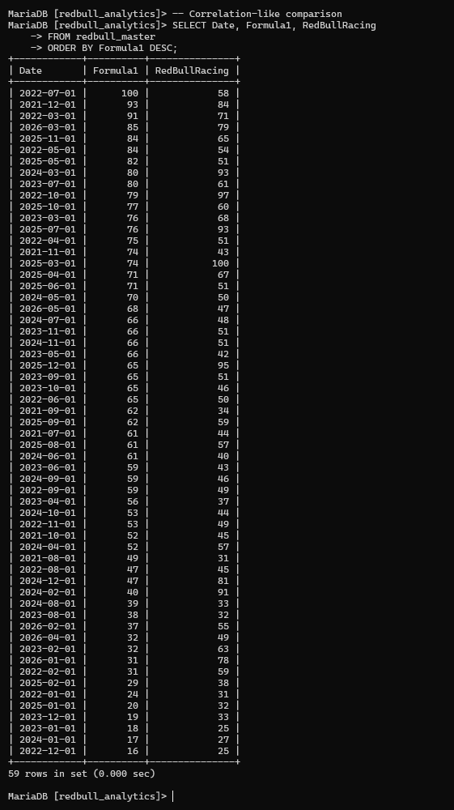
---

## Future Improvements

* Real-time Google Trends API integration
* Advanced forecasting models
* Sentiment analysis from social media
* Interactive web dashboard deployment
* Automated data pipelines

---

Developed by Sreerag S
